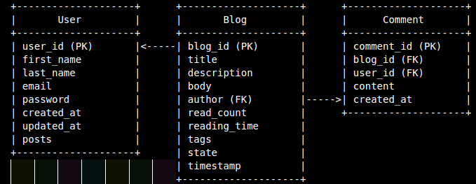

# Blogging API - 3MTT Backend Engineering – Intermediate Module Assessment
​
You are required to build a blogging api. The general idea here is that the api has a general endpoint that shows a list of articles that have been created by different people, and anybody that calls this endpoint, should be able to read a blog created by them or other users.

## Requirements

Users should have a first_name, last_name, email, password, (you can add other attributes you want to store about the user)
A user should be able to sign up and sign in into the blog app
Use JWT as authentication strategy and expire the token after 1 hour
A blog can be in two states; draft and published
Logged in and not logged in users should be able to get a list of published blogs created
Logged in and not logged in users should be able to to get a published blog
Logged in users should be able to create a blog.
When a blog is created, it is in draft state
The owner of the blog should be able to update the state of the blog to published
 The owner of a blog should be able to edit the blog in draft or published state
 The owner of the blog should be able to delete the blog in draft or published state
The owner of the blog should be able to get a list of their blogs.
The endpoint should be paginated
It should be filterable by state
Blogs created should have title, description, tags, author, timestamp, state, read_count, reading_time and body.
The list of blogs endpoint that can be accessed by both logged in and not logged in users should be paginated,
default it to 20 blogs per page. 
It should also be searchable by author, title and tags.
It should also be orderable by read_count, reading_time and timestamp
When a single blog is requested, the api should return the user information(the author) with the blog. The read_count of the blog too should be updated by 1
Come up with any algorithm for calculating the reading_time of the blog.
Write tests for all endpoints
Create an ERD for entities and show relationships
Use Winston and ensure functions and processes are logged

### Note

The owner of the blog should be logged in to perform actions

Extra points for building the views(optional)

### Database

Use MongoDB

Data Models

### User

– email is required and should be unique

– first_name is required

– last_name is required

– password

– created_at

– udated_at

### Blog/Article

– title is required and unique

– description

– author

– state

– read_count

– reading_time

– tags

– body is required

– timestamp

### Comment

– comment_id (Primary Key)

– blog_id (Foreign Key to Blog.blog_id)

– user_id (Foreign Key to User.user_id)

– content

– created_at

## ERD Diagram

